# Design Document

## Overview

This design document outlines the refactoring of the monolithic `src/blessed/app.ts` file (1059 lines) into focused, maintainable modules with clear separation of concerns. The refactoring will extract distinct responsibilities into separate modules while maintaining backward compatibility and leveraging existing blessed components.

## Architecture

### Current State
The current `app.ts` file handles multiple responsibilities:
- Application lifecycle and initialization
- Command parsing and handling (`/persona`, `/quit`, `/refresh`, `/help`)
- Persona management and switching
- Message processing and queuing
- UI event handling and rendering coordination
- E2E test input injection
- Exit/cleanup logic

### Target Architecture
```
src/blessed/
├── app.ts (main orchestration, ~300 lines)
├── command-handler.ts (command logic, ~200 lines)
├── persona-manager.ts (persona state management, ~250 lines)
├── message-processor.ts (message queuing/processing, ~200 lines)
├── test-support.ts (E2E test input injection, ~100 lines)
├── chat-renderer.ts (existing - chat display)
├── focus-manager.ts (existing - input focus)
├── layout-manager.ts (existing - responsive layout)
└── persona-renderer.ts (existing - persona list)
```

### Module Dependencies

```mermaid
graph TD
    A[app.ts] --> B[command-handler.ts]
    A --> C[persona-manager.ts]
    A --> D[message-processor.ts]
    A --> E[test-support.ts]
    A --> F[chat-renderer.ts]
    A --> G[focus-manager.ts]
    A --> H[layout-manager.ts]
    A --> I[persona-renderer.ts]
    
    B --> C
    B --> D
    C --> I
    D --> F
    E --> B
    E --> C
    E --> D
```


## Components and Interfaces

### App Module (app.ts)
**Responsibility**: Main orchestration and lifecycle management

**Interface**:
```typescript
export class EIApp {
  // Public methods for E2E testing
  public injectTestInput(input: string): void;
  
  // Private orchestration methods
  private initializeUI(): void;
  private setupEventHandlers(): void;
  private handleExit(): void;
}
```

**Key Methods**:
- `constructor()` - Initialize all managers and UI components
- `initializeUI()` - Set up blessed screen and layout
- `setupEventHandlers()` - Coordinate event handling across modules
- `handleExit()` - Clean shutdown coordination

### Command Handler Module
**Responsibility**: Parse and execute all user commands

**Interface**:
```typescript
export interface ICommandHandler {
  parseCommand(input: string): ParsedCommand | null;
  executeCommand(command: ParsedCommand): Promise<void>;
  getHelpText(): string;
}

export interface ParsedCommand {
  type: 'persona' | 'quit' | 'refresh' | 'help';
  args: string[];
  raw: string;
}

export class CommandHandler implements ICommandHandler {
  constructor(
    private personaManager: IPersonaManager,
    private messageProcessor: IMessageProcessor,
    private app: EIApp
  ) {}
}
```

**Key Methods**:
- `parseCommand()` - Parse input starting with "/"
- `executeCommand()` - Route to appropriate handler
- `handlePersonaCommand()` - Switch personas
- `handleQuitCommand()` - Initiate graceful shutdown
- `handleRefreshCommand()` - Refresh UI state
- `handleHelpCommand()` - Display help text

### Persona Manager Module
**Responsibility**: Manage persona state and switching

**Interface**:
```typescript
export interface IPersonaManager {
  switchPersona(name: string): Promise<void>;
  getCurrentPersona(): string;
  getPersonaState(name: string): PersonaState;
  updateUnreadCount(persona: string, delta: number): void;
  getAllPersonaStates(): Map<string, PersonaState>;
}

export class PersonaManager implements IPersonaManager {
  constructor(
    private personaRenderer: PersonaRenderer,
    private chatRenderer: ChatRenderer
  ) {}
}
```

**Key Methods**:
- `switchPersona()` - Handle persona switching logic
- `loadPersonaData()` - Load persona history and state
- `updatePersonaState()` - Update PersonaState map
- `getUnreadCount()` - Get unread message count
- `refreshPersonaList()` - Update persona list display

### Message Processor Module
**Responsibility**: Handle message queuing and LLM processing

**Interface**:
```typescript
export interface IMessageProcessor {
  processMessage(persona: string, message: string): Promise<void>;
  startHeartbeat(persona: string): void;
  stopHeartbeat(persona: string): void;
  abortProcessing(persona: string): void;
  isProcessing(persona: string): boolean;
}

export class MessageProcessor implements IMessageProcessor {
  constructor(
    private chatRenderer: ChatRenderer,
    private personaManager: IPersonaManager
  ) {}
}
```

**Key Methods**:
- `processMessage()` - Queue and process user messages
- `handleLLMResponse()` - Process LLM responses
- `manageHeartbeat()` - Handle persona heartbeat timers
- `handleDebounce()` - Manage message debouncing
- `updateMessageState()` - Update message processing states

### Test Support Module
**Responsibility**: E2E test input injection system

**Interface**:
```typescript
export interface ITestSupport {
  isTestModeEnabled(): boolean;
  setupTestInputInjection(): void;
  processTestInput(input: string): void;
  injectTestInput(input: string): void;
}

export class TestSupport implements ITestSupport {
  constructor(
    private commandHandler: ICommandHandler,
    private messageProcessor: IMessageProcessor,
    private app: EIApp
  ) {}
}
```

**Key Methods**:
- `setupTestInputInjection()` - Initialize stdin listening for E2E tests
- `processTestInput()` - Route test input to appropriate handlers
- `injectTestInput()` - Public method for direct test input injection
- `handleTestQuit()` - Clean exit for testing scenarios

## Data Models

### PersonaState Interface
```typescript
interface PersonaState {
  name: string;
  heartbeatTimer: ReturnType<typeof setTimeout> | null;
  debounceTimer: ReturnType<typeof setTimeout> | null;
  lastActivity: number;
  isProcessing: boolean;
  messageQueue: string[];
  unreadCount: number;
  abortController: AbortController | null;
}
```

### Module Configuration
```typescript
interface ModuleConfig {
  debugMode: boolean;
  testMode: boolean;
  heartbeatInterval: number;
  debounceMs: number;
  ctrlCConfirmationWindow: number;
}
```

## Correctness Properties

*A property is a characteristic or behavior that should hold true across all valid executions of a system-essentially, a formal statement about what the system should do. Properties serve as the bridge between human-readable specifications and machine-verifiable correctness guarantees.*

Let me analyze the acceptance criteria for testability:

<function_calls>
<invoke name="prework">
<parameter name="featureName">app-modularization

### Behavioral Equivalence Properties

Property 1: Application behavior preservation
*For any* application operation (startup, command execution, persona switching, message processing), the refactored system should produce identical behavior to the pre-refactoring version
**Validates: Requirements 2.2, 2.3, 2.4, 2.5**

Property 2: Command processing equivalence  
*For any* valid command input, the refactored command handler should parse and execute identically to the pre-refactoring version
**Validates: Requirements 5.1, 5.2, 5.3, 5.4**

Property 3: Persona state management equivalence
*For any* persona state operation (switching, unread count tracking, storage integration), the refactored persona manager should behave identically to the pre-refactoring version
**Validates: Requirements 6.1, 6.2, 6.3, 6.5**

Property 4: Message processing equivalence
*For any* message processing operation (queuing, LLM interaction, heartbeat management, debouncing, cancellation), the refactored message processor should behave identically to the pre-refactoring version
**Validates: Requirements 7.1, 7.2, 7.3, 7.4, 7.5**

Property 5: Error handling preservation
*For any* error scenario, the refactored system should handle errors, generate messages, log events, recover, and propagate errors identically to the pre-refactoring version
**Validates: Requirements 11.1, 11.2, 11.3, 11.4, 11.5**

Property 6: Test system equivalence
*For any* test input (E2E test injection, stdin input, test mode detection), the refactored system should process test inputs identically to the pre-refactoring version
**Validates: Requirements 3.6, 3.7, 9.1, 9.2, 9.3, 9.4**

### Performance Properties

Property 7: Response time preservation
*For any* user operation (command processing, persona switching, message processing), the response time should not increase by more than 5% after refactoring
**Validates: Requirements 8.2, 8.3, 8.4**

### Example-Based Properties

The following properties are best validated through specific examples rather than property-based testing:

- **API compatibility**: Verify that public methods exist with identical signatures (Requirements 2.1)
- **Test suite compatibility**: Verify that all existing unit, integration, and E2E tests pass (Requirements 3.1, 3.2, 3.3, 3.4, 3.5, 9.5, 9.6)
- **Interface definition**: Verify that TypeScript interfaces are defined and prevent breaking changes (Requirements 4.1, 4.4)
- **Module integration**: Verify that existing module interfaces are preserved (Requirements 10.6)
- **Performance baselines**: Verify startup time and memory usage stay within bounds (Requirements 8.1, 8.5)

## Error Handling

### Error Propagation Strategy
The refactored modules must maintain the existing error handling patterns:

1. **Command Handler Errors**: Invalid commands should produce identical error messages
2. **Persona Manager Errors**: Persona switching failures should maintain existing error behavior
3. **Message Processor Errors**: LLM errors and processing failures should propagate identically
4. **Test Support Errors**: Test input failures should maintain existing error behavior

### Error Recovery
Each module must implement the same error recovery patterns as the current monolithic implementation:
- Graceful degradation when components fail
- Proper cleanup of resources (timers, AbortControllers)
- Consistent error logging format and level

## Testing Strategy

### Dual Testing Approach
The refactoring will be validated using both unit tests and property-based tests:

**Unit Tests**:
- Verify specific examples and edge cases
- Test module interfaces and integration points
- Validate error conditions and recovery behavior
- Ensure existing test suites continue to pass

**Property-Based Tests**:
- Verify universal properties across all inputs using fast-check
- Test behavioral equivalence between old and new implementations
- Validate performance characteristics across input ranges
- Each property test will run minimum 100 iterations

### Property Test Configuration
Each property-based test will be tagged with:
**Feature: app-modularization, Property {number}: {property_text}**

### Test Implementation Strategy
1. **Regression Testing**: All existing tests (unit, integration, E2E) must pass without modification
2. **Behavioral Comparison**: Property tests will compare refactored behavior against baseline behavior
3. **Performance Validation**: Measure and compare performance metrics before and after refactoring
4. **Interface Testing**: Verify TypeScript interfaces prevent breaking changes

### Testing Phases
1. **Pre-refactoring Baseline**: Capture current behavior and performance metrics
2. **Incremental Validation**: Test each module extraction step
3. **Integration Testing**: Verify modules work together correctly
4. **Full System Testing**: Validate complete refactored system against baseline