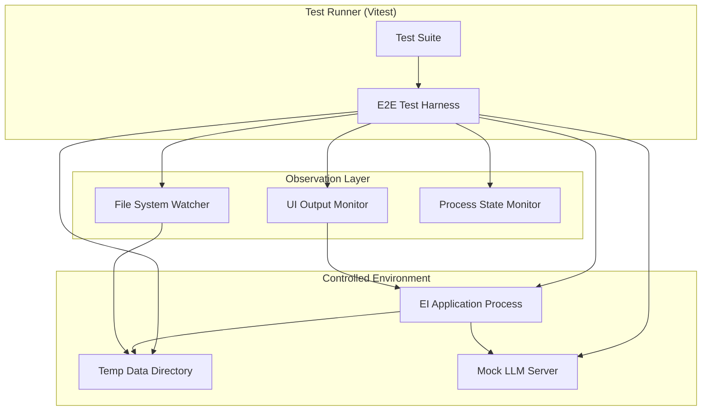
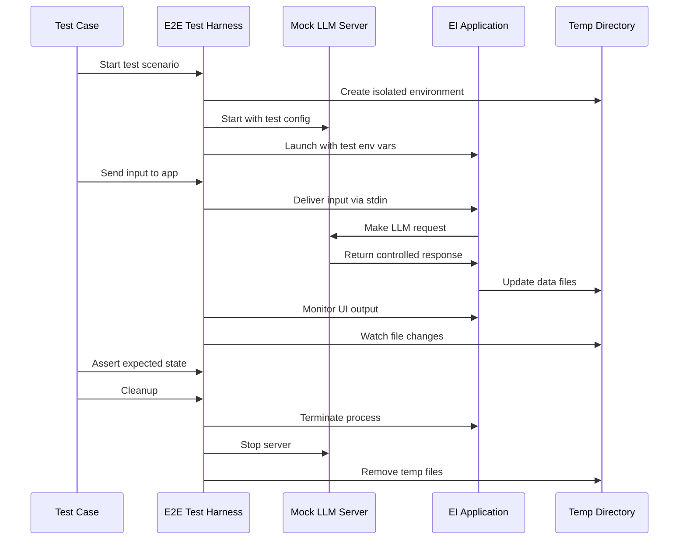

# Design Document

## Overview

This design outlines the implementation of a comprehensive End-to-End (E2E) testing proof of concept for the EI application. The system will provide true integration testing capabilities by controlling the application environment, managing LLM interactions, and validating real application behavior through automated test scenarios.

The design leverages existing Node.js testing infrastructure (Vitest) while introducing specialized components for terminal application testing, mock LLM server management, and controlled environment orchestration.

## Architecture

### High-Level Architecture



### Component Interaction Flow



## Components and Interfaces

### E2E Test Harness

The central orchestration component that manages test lifecycle and provides the primary API for test scenarios.

```typescript
interface E2ETestHarness {
  // Lifecycle management
  setup(config: TestConfig): Promise<void>;
  cleanup(): Promise<void>;
  
  // Application control
  startApp(options?: AppStartOptions): Promise<void>;
  stopApp(): Promise<void>;
  sendInput(text: string): Promise<void>;
  sendCommand(command: string): Promise<void>;
  
  // State observation
  waitForUIChange(timeout?: number): Promise<string>;
  waitForFileChange(filePath: string, timeout?: number): Promise<void>;
  waitForProcessingComplete(timeout?: number): Promise<void>;
  
  // Assertions
  assertUIContains(text: string): void;
  assertFileExists(filePath: string): void;
  assertPersonaState(persona: string, expectedState: PersonaState): void;
}

interface TestConfig {
  tempDirPrefix?: string;
  mockServerPort?: number;
  appTimeout?: number;
  cleanupTimeout?: number;
  mockResponses?: MockResponseConfig[];
}
```

### Mock LLM Server

A lightweight HTTP server that implements OpenAI-compatible endpoints for controlled testing.

```typescript
interface MockLLMServer {
  start(port: number, config: MockServerConfig): Promise<void>;
  stop(): Promise<void>;
  
  // Response configuration
  setResponse(endpoint: string, response: MockResponse): void;
  setDelay(endpoint: string, delayMs: number): void;
  enableStreaming(endpoint: string, chunks: string[]): void;
  
  // Request monitoring
  getRequestHistory(): MockRequest[];
  clearRequestHistory(): void;
}

interface MockServerConfig {
  responses: Record<string, MockResponse>;
  defaultDelay?: number;
  enableLogging?: boolean;
}

interface MockResponse {
  type: 'fixed' | 'streaming' | 'error';
  content: string | string[];
  delayMs?: number;
  statusCode?: number;
}
```

### Application Process Manager

Manages the EI application as a controlled subprocess with input/output handling.

```typescript
interface AppProcessManager {
  start(config: AppConfig): Promise<ChildProcess>;
  stop(process: ChildProcess): Promise<void>;
  
  // Input/Output
  sendInput(process: ChildProcess, text: string): Promise<void>;
  getOutput(process: ChildProcess, lines?: number): Promise<string>;
  
  // State monitoring
  isRunning(process: ChildProcess): boolean;
  waitForExit(process: ChildProcess, timeout?: number): Promise<number>;
}

interface AppConfig {
  dataPath: string;
  llmBaseUrl: string;
  llmApiKey: string;
  llmModel: string;
  debugMode?: boolean;
}
```

### Environment Manager

Handles temporary directory creation, cleanup, and environment variable management.

```typescript
interface EnvironmentManager {
  createTempDir(prefix: string): Promise<string>;
  cleanupTempDir(path: string): Promise<void>;
  
  // Environment setup
  setTestEnvironment(config: EnvironmentConfig): void;
  restoreEnvironment(): void;
  
  // File system monitoring
  watchFile(filePath: string, callback: (event: string) => void): FileWatcher;
  unwatchFile(watcher: FileWatcher): void;
}

interface EnvironmentConfig {
  EI_DATA_PATH: string;
  EI_LLM_BASE_URL: string;
  EI_LLM_API_KEY: string;
  EI_LLM_MODEL: string;
}
```

## Data Models

### Test Scenario Configuration

```typescript
interface TestScenario {
  name: string;
  description: string;
  setup: TestSetupConfig;
  steps: TestStep[];
  assertions: TestAssertion[];
  cleanup?: TestCleanupConfig;
}

interface TestSetupConfig {
  personas?: PersonaConfig[];
  mockResponses?: MockResponseConfig[];
  initialData?: InitialDataConfig;
}

interface TestStep {
  type: 'input' | 'command' | 'wait' | 'assert';
  action: string;
  timeout?: number;
  expectedResult?: any;
}

interface TestAssertion {
  type: 'ui' | 'file' | 'state' | 'process';
  target: string;
  condition: string;
  expected: any;
}
```

### Application State Models

```typescript
interface PersonaState {
  name: string;
  isProcessing: boolean;
  unreadCount: number;
  lastActivity: number;
  messageQueue: string[];
}

interface ApplicationState {
  activePersona: string;
  personas: PersonaState[];
  isProcessing: boolean;
  inputHasText: boolean;
  statusMessage?: string;
}
```

## Correctness Properties

*A property is a characteristic or behavior that should hold true across all valid executions of a system-essentially, a formal statement about what the system should do. Properties serve as the bridge between human-readable specifications and machine-verifiable correctness guarantees.*

Now I need to analyze the acceptance criteria to determine which ones can be tested as properties. Let me use the prework tool to analyze the requirements.

### Converting EARS to Properties

Based on the prework analysis, I'll convert the testable acceptance criteria into universally quantified properties, consolidating related criteria to avoid redundancy.

**Property 1: Environment Isolation and Cleanup**
*For any* test execution, the test harness should create a unique temporary directory, ensure the application uses only that directory for data operations, and completely clean up all test artifacts after completion
**Validates: Requirements 1.1, 1.2, 1.3, 1.5**

**Property 2: Concurrent Test Isolation**
*For any* set of concurrently running tests, each test should receive a unique data directory and operate independently without interference
**Validates: Requirements 1.4**

**Property 3: Application Process Lifecycle Management**
*For any* test scenario, the test harness should successfully start the application as a background process, verify initialization within timeout, handle input/output correctly, and capture exit codes and final state
**Validates: Requirements 2.1, 2.2, 2.3, 2.4**

**Property 4: Process Timeout and Termination**
*For any* application process that becomes unresponsive, the test harness should terminate it after the configured timeout period
**Validates: Requirements 2.5**

**Property 5: Application State Monitoring**
*For any* application state change (UI updates, file modifications, processing transitions, command execution), the test harness should detect and record the change, and provide methods to wait for specific conditions
**Validates: Requirements 3.1, 3.2, 3.3, 3.4, 3.5**

**Property 6: Mock LLM Server API Compatibility**
*For any* OpenAI-compatible API request, the mock server should respond correctly with configurable content, delays, and streaming support, while logging all interactions
**Validates: Requirements 4.1, 4.2, 4.3, 4.4, 4.5**

**Property 7: State Persistence Across Operations**
*For any* application operation (including quit commands), the application should persist all current state before termination, ensuring data integrity
**Validates: Requirements 5.5**

**Property 8: Multi-Persona Independence**
*For any* multi-persona scenario, each persona should maintain independent state without interference from other personas' operations
**Validates: Requirements 6.3**

**Property 9: Error Handling and Recovery**
*For any* error condition encountered during testing, the system should handle errors gracefully and provide appropriate recovery mechanisms
**Validates: Requirements 6.4**

**Property 10: Data Persistence Across Restarts**
*For any* application restart scenario, all persisted state should survive and be correctly restored
**Validates: Requirements 6.5**

**Property 11: Test Failure Diagnostics**
*For any* test failure, the test framework should provide clear, actionable diagnostic information
**Validates: Requirements 7.2**

**Property 12: Test Execution Metrics**
*For any* test execution, the framework should accurately report execution time and resource usage metrics
**Validates: Requirements 7.3**

**Property 13: Configuration Flexibility**
*For any* configuration parameter (timeouts, responses, delays, environment overrides), the system should respect the configured values and support both programmatic and file-based configuration
**Validates: Requirements 8.1, 8.2, 8.3, 8.5**

**Property 14: Extensibility Hooks**
*For any* custom test scenario requiring specialized behavior, the test harness should provide extensible hooks that are called at appropriate times
**Validates: Requirements 8.4**

## Error Handling

### Error Categories and Strategies

**Application Startup Errors**
- Timeout during initialization
- Port conflicts for mock server
- Permission issues with temp directories
- Missing dependencies or configuration

Strategy: Fail fast with clear error messages, automatic cleanup of partial state

**Runtime Errors**
- Application crashes during test execution
- Mock server connection failures
- File system permission errors
- Timeout violations

Strategy: Graceful degradation, attempt recovery where possible, detailed logging

**Cleanup Errors**
- Temp directory removal failures
- Process termination timeouts
- Resource leak detection

Strategy: Best-effort cleanup with warnings, prevent test suite failures due to cleanup issues

### Error Recovery Mechanisms

```typescript
interface ErrorRecovery {
  // Automatic retry with exponential backoff
  retryWithBackoff<T>(operation: () => Promise<T>, maxRetries: number): Promise<T>;
  
  // Graceful degradation for non-critical failures
  gracefulDegrade(error: Error, fallbackAction: () => void): void;
  
  // Resource cleanup on error
  emergencyCleanup(resources: TestResource[]): Promise<void>;
}
```

## Testing Strategy

### Dual Testing Approach

The e2e testing framework itself requires comprehensive testing using both unit tests and property-based tests:

**Unit Tests**
- Mock server endpoint compatibility
- Environment variable handling
- File system operations
- Process lifecycle management
- Configuration parsing and validation
- Error handling edge cases

**Property-Based Tests**
- Environment isolation across concurrent tests (Property 2)
- State monitoring accuracy (Property 5)
- Configuration parameter handling (Property 13)
- Error recovery mechanisms (Property 9)
- Resource cleanup completeness (Property 1)

### Testing the E2E Framework

**Framework Unit Tests**
```typescript
describe('E2E Test Harness Unit Tests', () => {
  test('creates unique temp directories for concurrent tests', () => {
    // Test specific directory creation logic
  });
  
  test('mock server returns configured responses', () => {
    // Test mock server response configuration
  });
  
  test('process manager handles application lifecycle', () => {
    // Test process start/stop/monitoring
  });
});
```

**Framework Property Tests**
```typescript
describe('E2E Test Harness Property Tests', () => {
  test('Property 1: Environment isolation and cleanup', () => {
    fc.assert(fc.property(
      fc.array(fc.string(), { minLength: 1, maxLength: 5 }),
      async (testNames) => {
        // For any set of test names, verify isolation and cleanup
        const harnesses = testNames.map(() => new E2ETestHarness());
        
        // All should get unique directories
        const tempDirs = await Promise.all(
          harnesses.map(h => h.setup({ tempDirPrefix: 'test' }))
        );
        
        const uniqueDirs = new Set(tempDirs);
        expect(uniqueDirs.size).toBe(tempDirs.length);
        
        // All should clean up completely
        await Promise.all(harnesses.map(h => h.cleanup()));
        
        // Verify no directories remain
        for (const dir of tempDirs) {
          expect(fs.existsSync(dir)).toBe(false);
        }
      }
    ), { numRuns: 100 });
  });
});
```

**Property Test Configuration**
- Minimum 100 iterations per property test
- Each property test references its design document property
- Tag format: **Feature: e2e-testing-poc, Property {number}: {property_text}**

### Integration with Existing Test Suite

The e2e tests will integrate seamlessly with the existing Vitest-based test infrastructure:

```typescript
// vitest.config.ts additions
export default defineConfig({
  test: {
    // ... existing config
    include: ["tests/**/*.test.ts", "tests/e2e/**/*.e2e.test.ts"],
    testTimeout: 30000, // Longer timeout for e2e tests
  },
});
```

**Test Organization**
```
tests/
├── unit/                    # Existing unit tests
├── integration/             # Existing integration tests
└── e2e/                     # New e2e tests
    ├── framework/           # Tests for the e2e framework itself
    │   ├── harness.test.ts
    │   ├── mock-server.test.ts
    │   └── environment.test.ts
    └── scenarios/           # Actual e2e test scenarios
        ├── quit-command.e2e.test.ts
        ├── multi-persona.e2e.test.ts
        └── basic-flow.e2e.test.ts
```

### Microsoft TUI Test Integration

For advanced terminal interaction testing, the framework will optionally integrate with Microsoft's TUI Test framework:

```typescript
interface TUITestIntegration {
  // Enhanced terminal interaction capabilities
  captureScreenshot(): Promise<Buffer>;
  assertTerminalContent(expectedContent: string): void;
  sendKeySequence(keys: string[]): Promise<void>;
  waitForTerminalRender(timeout?: number): Promise<void>;
}
```

This integration provides:
- Rich terminal assertions with visual verification
- Keyboard input simulation for complex interactions
- Terminal screenshot capture for debugging
- Cross-platform terminal compatibility testing

The TUI Test integration will be optional and used for scenarios requiring advanced terminal interaction verification beyond basic input/output testing.