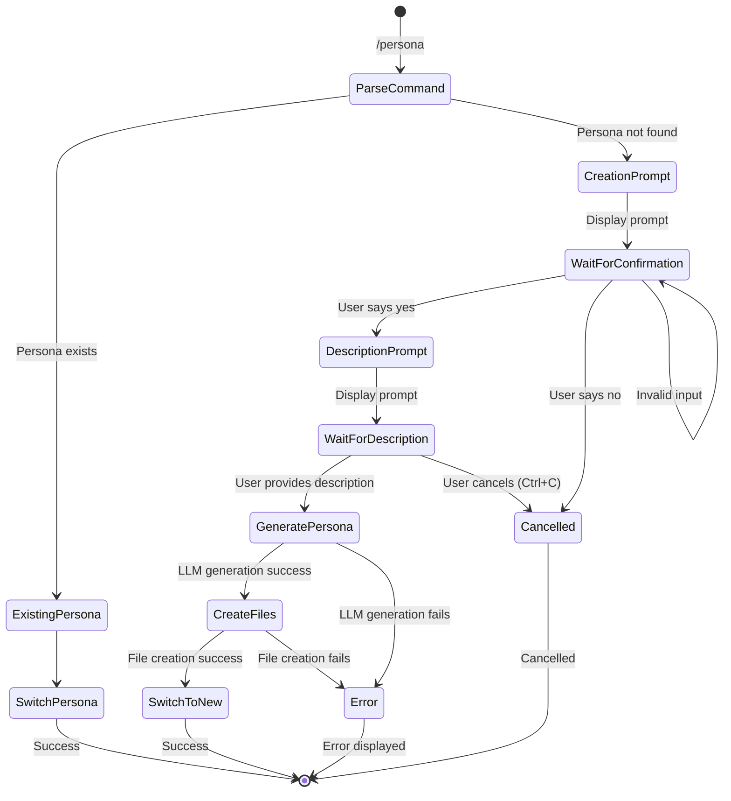

# Design Document

## Overview

The Interactive Persona Creation feature extends the existing `/persona <name>` command to provide seamless persona creation when a requested persona doesn't exist. The design leverages the existing persona generation system (`persona-creator.ts`) and blessed UI patterns to create an integrated, user-friendly experience.

The solution follows a state-machine approach where the persona command can transition into creation mode, handle user input through multiple steps, and gracefully handle errors or cancellation at any point.

## Architecture

### High-Level Flow



### Component Integration

The feature integrates with existing EI components:

- **EIApp.handlePersonaCommand()**: Enhanced to detect non-existing personas and initiate creation flow
- **persona-creator.ts**: Existing `createPersonaWithLLM()` function for actual persona generation
- **storage.ts**: Existing `findPersonaByNameOrAlias()` for persona lookup and file operations
- **blessed UI**: Status messages and input handling through existing patterns

## Components and Interfaces

### Enhanced Persona Command Handler

```typescript
interface PersonaCreationState {
  targetPersonaName: string;
  awaitingConfirmation: boolean;
  awaitingDescription: boolean;
  isGenerating: boolean;
}

class EIApp {
  private personaCreationState: PersonaCreationState | null = null;
  
  private async handlePersonaCommand(args: string): Promise<void> {
    // Enhanced logic for creation flow
  }
  
  private async initiatePersonaCreation(personaName: string): Promise<void> {
    // Start creation flow
  }
  
  private async handleCreationConfirmation(input: string): Promise<void> {
    // Handle y/n response
  }
  
  private async handleDescriptionInput(description: string): Promise<void> {
    // Process user description and generate persona
  }
  
  private cancelPersonaCreation(): void {
    // Clean up creation state
  }
}
```

### Input State Management

The design uses a state-based approach to handle the multi-step creation process:

1. **Normal State**: Regular command processing
2. **Awaiting Confirmation**: Waiting for y/n response to creation prompt
3. **Awaiting Description**: Waiting for persona description input
4. **Generating**: Persona generation in progress (non-interactive)

### Persona Name Validation

```typescript
interface ValidationResult {
  isValid: boolean;
  errorMessage?: string;
}

function validatePersonaName(name: string): ValidationResult {
  // Validation logic for persona names
}
```

Validation rules:
- No spaces (suggest hyphens/underscores)
- Only alphanumeric, hyphens, underscores
- Not empty
- Maximum 50 characters
- Not reserved names (if any)

## Data Models

### Creation State Model

```typescript
interface PersonaCreationState {
  targetPersonaName: string;        // Name of persona being created
  awaitingConfirmation: boolean;    // Waiting for y/n response
  awaitingDescription: boolean;     // Waiting for description input
  isGenerating: boolean;            // LLM generation in progress
  originalPersona: string;          // Persona to return to if cancelled
}
```

### Input Handling Model

The design extends the existing blessed input handling to recognize when the application is in creation mode:

```typescript
// In input handler
if (this.personaCreationState) {
  if (this.personaCreationState.awaitingConfirmation) {
    await this.handleCreationConfirmation(input);
    return;
  }
  if (this.personaCreationState.awaitingDescription) {
    await this.handleDescriptionInput(input);
    return;
  }
}
// Normal command processing...
```

## Correctness Properties

*A property is a characteristic or behavior that should hold true across all valid executions of a system-essentially, a formal statement about what the system should do. Properties serve as the bridge between human-readable specifications and machine-verifiable correctness guarantees.*

Before defining the correctness properties, I need to analyze the acceptance criteria for testability:

### Converting EARS to Properties

Based on the prework analysis, I'll convert the testable acceptance criteria into universally quantified properties:

**Property 1: Existing persona switching preservation**
*For any* existing persona name, when the `/persona <name>` command is used, the system should switch to that persona without prompting for creation
**Validates: Requirements 1.1**

**Property 2: Non-existing persona creation prompt**
*For any* non-existing persona name, when the `/persona <name>` command is used, the system should display the creation prompt "Persona '<name>' not found. Create it? (y/n)"
**Validates: Requirements 1.2**

**Property 3: Confirmation input handling**
*For any* confirmation prompt response, the system should handle "y"/"yes" by continuing to description prompt, "n"/"no" by cancelling with appropriate message, and invalid input by re-prompting
**Validates: Requirements 1.3, 1.4, 1.5**

**Property 4: Successful persona creation**
*For any* valid persona name and description, when persona creation completes successfully, the system should create all required files, initialize proper data structures, switch to the new persona, and make it available for future commands
**Validates: Requirements 2.2, 2.4, 2.5, 6.1, 6.2, 6.3, 6.4, 6.5, 7.4**

**Property 5: Persona name validation**
*For any* invalid persona name (containing spaces, special characters, empty, or too long), the system should reject it with appropriate error message and not attempt creation
**Validates: Requirements 3.1, 3.2, 3.3, 3.4, 3.5**

**Property 6: Error handling and cleanup**
*For any* creation failure (LLM errors, file system errors, etc.), the system should display appropriate error message, not leave partial files, and maintain the original active persona
**Validates: Requirements 4.1, 4.2, 4.3, 4.4**

**Property 7: Cancellation behavior**
*For any* cancellation during the creation process, the system should not create persona files, return to the original active persona, and restore normal operation
**Validates: Requirements 4.5, 5.4, 5.5**

## Error Handling

### Error Categories

1. **Validation Errors**: Invalid persona names, handled synchronously with immediate feedback
2. **LLM Errors**: Network issues, API failures, generation timeouts
3. **File System Errors**: Permission issues, disk space, directory creation failures
4. **User Cancellation**: Ctrl+C at any step, explicit "no" responses

### Error Recovery Strategy

- **Atomic Operations**: Either complete persona creation succeeds entirely or fails entirely
- **State Cleanup**: Always return to original persona and clear creation state on any failure
- **User Feedback**: Provide specific, actionable error messages
- **Graceful Degradation**: System remains functional after any creation failure

### Cancellation Handling

The design supports cancellation at three key points:
1. **Confirmation Prompt**: User can say "no" or press Ctrl+C
2. **Description Prompt**: User can press Ctrl+C
3. **Generation Phase**: User can press Ctrl+C to abort LLM request

All cancellation paths lead to the same cleanup routine that restores original state.

## Testing Strategy

### Dual Testing Approach

The testing strategy combines unit tests for specific logic and property-based tests for comprehensive coverage:

**Unit Tests** focus on:
- Specific examples of persona name validation
- Error message formatting and display
- State transitions during creation flow
- Integration with existing persona switching logic

**Property-Based Tests** focus on:
- Universal properties across all valid/invalid inputs
- Comprehensive input coverage through randomization
- Edge cases and boundary conditions
- Error handling across different failure scenarios

### Property-Based Testing Configuration

Using **fast-check** library for TypeScript property-based testing:
- Minimum 100 iterations per property test
- Each property test references its design document property
- Tag format: **Feature: interactive-persona-creation, Property {number}: {property_text}**

### Test Coverage Areas

1. **Command Parsing**: Verify existing vs non-existing persona detection
2. **Input Validation**: Test all persona name validation rules
3. **State Management**: Verify creation state transitions
4. **File Operations**: Test persona directory and file creation
5. **Error Scenarios**: Mock various failure conditions
6. **Cancellation**: Test Ctrl+C handling at all steps
7. **Integration**: Verify interaction with existing persona system

### E2E Testing Integration

The existing E2E testing framework supports:
- Interactive input simulation with `sendInput()` and `sendCommand()`
- Multi-step user interaction flows
- File system verification
- Application state validation
- Mock LLM response configuration

Test scenarios will include:
- Complete successful creation flow
- Various cancellation scenarios
- Error handling validation
- Integration with existing persona switching