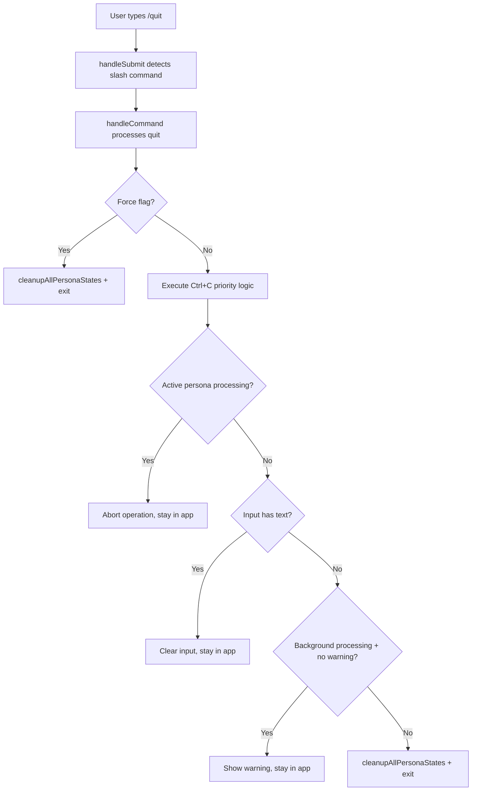

# Design Document: Quit Command

## Overview

This design implements a `/quit` slash command that replicates the exact Ctrl+C exit logic currently implemented in the EI application. The command provides a programmatic alternative to keyboard shortcuts, essential for automated testing and scripting scenarios.

The implementation extends the existing slash command infrastructure in `src/blessed/app.ts` by adding quit command handling to the `handleCommand` method. The command follows the same four-tier priority logic as the current `handleCtrlC` method.

## Architecture

### Command Processing Flow



### Integration Points

The quit command integrates with existing systems:

1. **Slash Command Infrastructure**: Extends the switch statement in `handleCommand` method
2. **Ctrl+C Logic**: Reuses the exact same priority logic from `handleCtrlC` method
3. **Cleanup System**: Uses the existing `cleanup` method for graceful shutdown
4. **Help System**: Updates the help command to document quit functionality

## Components and Interfaces

### Command Handler Extension

The `handleCommand` method in `EIApp` class will be extended with quit command cases:

```typescript
case "quit":
case "q": {
  const isForce = args.trim() === "--force";
  
  if (isForce) {
    this.cleanup();
    this.screen.destroy();
    process.exit(0);
    return;
  }
  
  // Execute identical Ctrl+C logic
  this.executeExitLogic();
  break;
}
```

### Shared Exit Logic

To avoid code duplication, the Ctrl+C priority logic will be extracted into a reusable method:

```typescript
private executeExitLogic(): void {
  // Priority 1: Abort active persona processing
  const activePs = this.getOrCreatePersonaState(this.activePersona);
  if (activePs.isProcessing) {
    this.abortPersonaOperation(this.activePersona);
    this.setStatus('Aborted current operation');
    return;
  }

  // Priority 2: Clear input text
  if (this.inputHasText) {
    this.layoutManager.getInputBox().clearValue();
    this.inputHasText = false;
    this.setStatus('Input cleared');
    return;
  }

  // Priority 3: Warn about background processing
  const backgroundProcessing = this.getBackgroundProcessingPersonas();
  const now = Date.now();
  const timeSinceWarning = this.ctrlCWarningTimestamp ? now - this.ctrlCWarningTimestamp : Infinity;
  
  if (backgroundProcessing.length > 0 && 
      (!this.ctrlCWarningTimestamp || timeSinceWarning > CTRL_C_CONFIRMATION_WINDOW_MS)) {
    const names = backgroundProcessing.join(', ');
    this.ctrlCWarningTimestamp = now;
    this.setStatus(`Processing in progress for: ${names}. Use /quit --force to exit immediately.`);
    return;
  }

  // Priority 4: Exit application
  this.cleanup();
  this.screen.destroy();
  process.exit(0);
}
```

### Help System Update

The help command will be updated to include quit commands:

```typescript
case 'help':
case 'h':
  this.setStatus('Commands: /persona <name>, /quit [--force], /refresh, /help | Keys: Ctrl+H (personas), Ctrl+L (input), Ctrl+R (refresh), Ctrl+C (exit)');
  break;
```

## Data Models

No new data models are required. The implementation reuses existing state management:

- `personaStates`: Map of persona processing states
- `ctrlCWarningTimestamp`: Timestamp for exit confirmation logic
- `inputHasText`: Boolean flag for input state tracking
- `activePersona`: Current active persona identifier

## Correctness Properties

*A property is a characteristic or behavior that should hold true across all valid executions of a system-essentially, a formal statement about what the system should do. Properties serve as the bridge between human-readable specifications and machine-verifiable correctness guarantees.*

Based on the prework analysis, the following properties validate the quit command functionality:

**Property 1: Quit command equivalence**
*For any* application state, executing `/quit` or `/q` should produce identical behavior to pressing Ctrl+C, following the exact same priority logic: abort active processing → clear input → show background warning → exit
**Validates: Requirements 1.1, 1.2, 1.3, 1.4**

**Property 2: Force exit bypass**
*For any* application state with active processing, input text, or background processing, executing `/quit --force` should bypass all safety checks, clean up persona states, and exit immediately without showing warnings
**Validates: Requirements 2.1, 2.2, 2.3, 2.4**

**Property 3: Active processing priority**
*For any* application state where the active persona is processing a message, executing `/quit` should abort the current operation and remain running without proceeding to other exit logic
**Validates: Requirements 3.1**

**Property 4: Input clearing priority**
*For any* application state with input text present and no active processing, executing `/quit` should clear the input and remain running without proceeding to other exit logic
**Validates: Requirements 3.2**

**Property 5: Background processing warning**
*For any* application state with background processing and no previous warning shown, executing `/quit` should display a warning message mentioning `/quit --force` and remain running
**Validates: Requirements 3.3, 3.5**

**Property 6: Exit condition**
*For any* application state where a warning has been shown OR no blocking conditions exist, executing `/quit` should exit the application
**Validates: Requirements 3.4**

**Property 7: Help system integration**
*For any* help command execution, the output should contain both `/quit` and `/q` commands with descriptions including the `--force` option and its purpose
**Validates: Requirements 4.1, 4.2, 4.3**

## Error Handling

### Command Parsing Errors

Invalid arguments to `/quit` will be handled gracefully:

```typescript
case "quit":
case "q": {
  const trimmedArgs = args.trim();
  
  // Validate arguments
  if (trimmedArgs && trimmedArgs !== "--force") {
    this.setStatus(`Invalid argument: ${trimmedArgs}. Usage: /quit [--force]`);
    return;
  }
  
  const isForce = trimmedArgs === "--force";
  // ... rest of implementation
}
```

### Processing Failures

If quit command processing encounters errors:

1. **Cleanup failures**: Attempt graceful degradation by continuing with remaining cleanup operations
2. **State inconsistencies**: Log errors and attempt to restore consistent state
3. **Exit failures**: Fall back to process.exit() with appropriate exit code

### Logging Strategy

All quit command operations will be logged using the existing debug logging system:

```typescript
debugLog(`Quit command executed: force=${isForce}, activeProcessing=${activePs.isProcessing}`);
```

## Testing Strategy

### Dual Testing Approach

The implementation will use both unit tests and property-based tests for comprehensive coverage:

**Unit Tests**: Verify specific examples, edge cases, and error conditions
- Test specific command parsing scenarios
- Test integration with existing help system
- Test error handling for invalid arguments
- Test cleanup operations during exit

**Property Tests**: Verify universal properties across all inputs
- Test quit command equivalence to Ctrl+C across all application states
- Test force exit behavior across all blocking conditions
- Test priority logic consistency across all state combinations
- Test error handling consistency across all failure scenarios

### Property-Based Testing Configuration

Using Vitest with fast-check library for property-based testing:
- Minimum 100 iterations per property test
- Each property test references its design document property
- Tag format: **Feature: quit-command, Property {number}: {property_text}**

### Test Implementation Strategy

1. **Mock Application State**: Create test harnesses that can simulate different application states (active processing, input text, background processing)
2. **Command Execution Testing**: Test both `/quit` and `/q` commands with and without `--force` flag
3. **State Verification**: Verify application state changes after command execution
4. **Output Verification**: Verify status messages, help text, and error messages
5. **Exit Behavior Testing**: Mock process.exit() to verify exit conditions without actually terminating tests

### Integration Testing

Integration tests will verify:
- Command processing through the full slash command pipeline
- Interaction with existing Ctrl+C logic
- Help system updates
- Cleanup operations with real persona states

The testing strategy ensures that the quit command implementation maintains the exact same behavior as the existing Ctrl+C functionality while providing the additional programmatic control needed for automated testing scenarios.

<function_calls>
<invoke name="prework">
<parameter name="featureName">quit-command