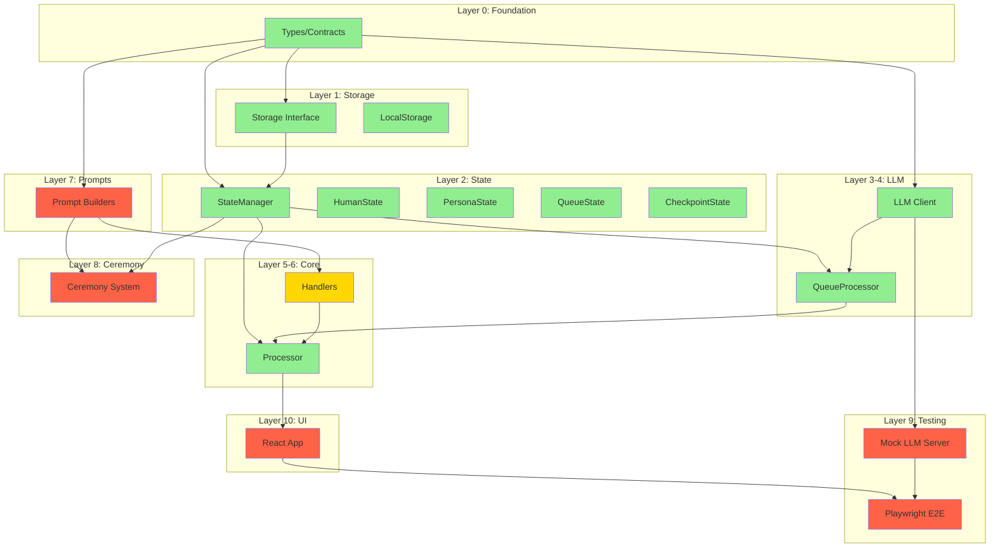

# V1 Dependency Graph & Implementation Status

Generated from codebase analysis on 2026-01-27.

## Status Legend
- **DONE** - Complete and tested
- **SCAFFOLDED** - Structure exists, needs implementation
- **STUB** - Interface defined, empty/placeholder implementation
- **NOT STARTED** - Doesn't exist yet

---

## Layer 0: Types & Contracts

| Component | Status | Notes |
|-----------|--------|-------|
| `CONTRACTS.md` | DONE | Source of truth |
| `src/core/types.ts` | DONE | All types aligned with contracts |

---

## Layer 1: Storage (No dependencies)

| Component | Status | Notes |
|-----------|--------|-------|
| `src/storage/interface.ts` | DONE | Storage interface |
| `src/storage/local.ts` | DONE | LocalStorage implementation |
| File/Node storage | NOT STARTED | For TUI mode (V1.1) |

---

## Layer 2: State Management (Depends on: Storage, Types)

| Component | Status | Notes |
|-----------|--------|-------|
| `src/core/state/human.ts` | DONE | HumanEntity CRUD |
| `src/core/state/personas.ts` | DONE | PersonaEntity + Messages CRUD |
| `src/core/state/queue.ts` | DONE | LLM queue operations |
| `src/core/state/checkpoints.ts` | DONE | Checkpoint management |
| `src/core/state-manager.ts` | DONE | Facade over state modules |

---

## Layer 3: LLM Client (Depends on: Types)

| Component | Status | Notes |
|-----------|--------|-------|
| Provider abstraction | DONE | 5 providers (local, openai, google, anthropic, xai) |
| Model routing | DONE | `provider:model` syntax |
| JSON parsing + repair | DONE | Handles malformed JSON |
| Abort support | DONE | AbortController integration |
| Streaming | NOT STARTED | V0 has it, port later |

---

## Layer 4: Queue Processor (Depends on: LLM Client, Types)

| Component | Status | Notes |
|-----------|--------|-------|
| `src/core/queue-processor.ts` | DONE | Single LLM executor |
| Request type handling | DONE | response/json/raw |
| "No message" detection | DONE | Patterns for non-response |

---

## Layer 5: Processor (Depends on: StateManager, QueueProcessor, Handlers)

| Component | Status | Notes |
|-----------|--------|-------|
| Lifecycle (start/stop) | DONE | Clean shutdown with save |
| Run loop | DONE | 100ms tick |
| Auto-save | DONE | Configurable interval |
| Heartbeat scheduling | SCAFFOLDED | Queues requests, but no prompts |
| Handler dispatch | DONE | Routes to handlers by next_step |
| All Processor API methods | DONE | Per CONTRACTS.md |

---

## Layer 6: Handlers (Depends on: StateManager, Types)

| Handler | Status | Notes |
|---------|--------|-------|
| `handlePersonaResponse` | DONE | Appends message to history |
| `handlePersonaGeneration` | STUB | Needs persona creation prompts |
| `handlePersonaDescriptions` | STUB | Needs description prompts |
| `handleHumanFactScan` | STUB | Step 1 extraction |
| `handleHumanTraitScan` | STUB | Step 1 extraction |
| `handleHumanTopicScan` | STUB | Step 1 extraction |
| `handleHumanPersonScan` | STUB | Step 1 extraction |
| `handleHumanItemMatch` | STUB | Step 2 extraction |
| `handleHumanItemUpdate` | STUB | Step 3 extraction |
| `handlePersonaTraitExtraction` | STUB | Persona trait learning |
| `handlePersonaTopicDetection` | STUB | Persona topic detection |
| `handlePersonaTopicExploration` | STUB | Persona topic generation |
| `handleHeartbeatCheck` | STUB | Heartbeat decision |
| `handleEiHeartbeat` | STUB | Ei-specific heartbeat |
| `handleEiValidation` | STUB | Cross-persona validation |

---

## Layer 7: Prompts (Depends on: Types)

| Prompt Category | Status | Files Needed |
|-----------------|--------|--------------|
| Response | NOT STARTED | `buildResponsePrompt` |
| Heartbeat Check | NOT STARTED | `buildHeartbeatCheckPrompt` |
| Ei Heartbeat | NOT STARTED | `buildEiHeartbeatPrompt` |
| Extraction Step 1 (Fact) | NOT STARTED | `buildHumanFactScanPrompt` |
| Extraction Step 1 (Trait) | NOT STARTED | `buildHumanTraitScanPrompt` |
| Extraction Step 1 (Topic) | NOT STARTED | `buildHumanTopicScanPrompt` |
| Extraction Step 1 (Person) | NOT STARTED | `buildHumanPersonScanPrompt` |
| Extraction Step 2 (Match) | NOT STARTED | `buildHumanItemMatchPrompt` |
| Extraction Step 3 (Update) | NOT STARTED | `buildHumanItemUpdatePrompt` |
| Persona Generation | NOT STARTED | `buildPersonaGenerationPrompt` |
| Persona Descriptions | NOT STARTED | `buildPersonaDescriptionsPrompt` |
| Persona Trait Extraction | NOT STARTED | `buildPersonaTraitExtractionPrompt` |
| Persona Topic Detection | NOT STARTED | `buildPersonaTopicDetectionPrompt` |
| Persona Topic Exploration | NOT STARTED | `buildPersonaTopicExplorationPrompt` |
| Ei Validation | NOT STARTED | `buildEiValidationPrompt` |
| One-Shot Helper | NOT STARTED | `buildOneShotPrompt` (backward doc feature) |

---

## Layer 8: Ceremony System (Depends on: Prompts, Handlers, StateManager)

| Component | Status | Notes |
|-----------|--------|-------|
| Ceremony orchestrator | NOT STARTED | Nightly batch process |
| Exposure phase | NOT STARTED | Runs extraction pipeline |
| Decay phase | NOT STARTED | Logarithmic decay on exposure_current |
| Expire phase | NOT STARTED | Remove low-interest topics |
| Explore phase | NOT STARTED | Generate new topics |
| Human ceremony | NOT STARTED | Decay human topics/people, prompt Ei |

---

## Layer 9: Testing Infrastructure (Depends on: All above)

| Component | Status | Source |
|-----------|--------|--------|
| Mock LLM Server | NOT STARTED | Port from `v0/tests/e2e/framework/mock-server.ts` |
| Playwright setup | NOT STARTED | New |
| Unit test harness | NOT STARTED | Vitest config |
| E2E test framework | NOT STARTED | Port from `v0/tests/e2e/framework/` |

---

## Layer 10: UI (Depends on: Processor, Types)

| Component | Status | Notes |
|-----------|--------|-------|
| Vite + React scaffold | NOT STARTED | |
| Layout (3-panel) | NOT STARTED | |
| Persona panel | NOT STARTED | List, controls, status indicators |
| Chat panel | NOT STARTED | History, markdown, input |
| Entity editor modal | NOT STARTED | Tabbed CRUD for facts/traits/topics/people |
| Persona editor modal | NOT STARTED | Settings, Identity, Topics, Context |
| Persona creator modal | NOT STARTED | With AI-assist buttons |
| Help modal | NOT STARTED | |
| Keyboard navigation | NOT STARTED | |
| Responsive layout | NOT STARTED | |

---

## Layer 11: Polish Features (Depends on: UI)

| Component | Status | Notes |
|-----------|--------|-------|
| Onboarding flow | NOT STARTED | LLM provider setup wizard |
| Persona images | NOT STARTED | AI generation on creation |
| Settings sync | NOT STARTED | flare576.com encrypted sync |
| Dynamic vs Static toggle | NOT STARTED | Per-persona setting |
| Context window UI | NOT STARTED | Message-level context_status management |

---

## Dependency Graph (Mermaid)

**Legend:**
- Green = DONE
- Yellow = SCAFFOLDED/PARTIAL
- Red = NOT STARTED

---

## Critical Path to MVP

The minimum viable path to a working V1:

1. **Prompts** - Need at least `buildResponsePrompt` for basic chat
2. **Testing** - Port mock server so we can test without real LLM
3. **UI scaffold** - Basic React app that can talk to Processor
4. **UI: Chat panel** - Display messages, send messages
5. **UI: Persona panel** - List personas, switch between them

Everything else (extraction, ceremony, entity editing, etc.) can come after MVP.
